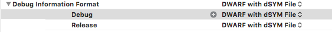
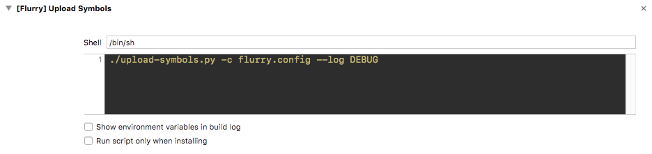
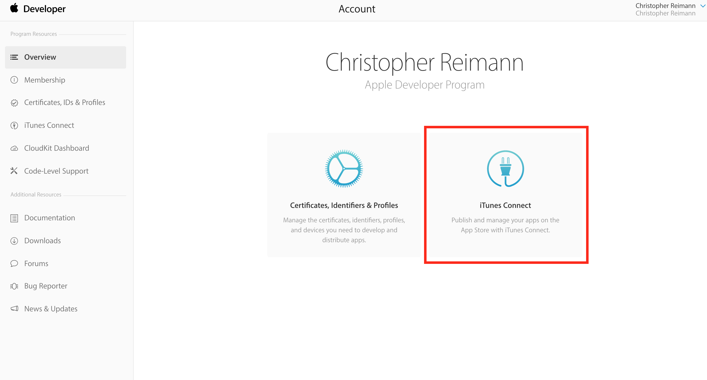
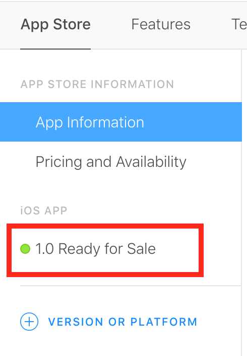
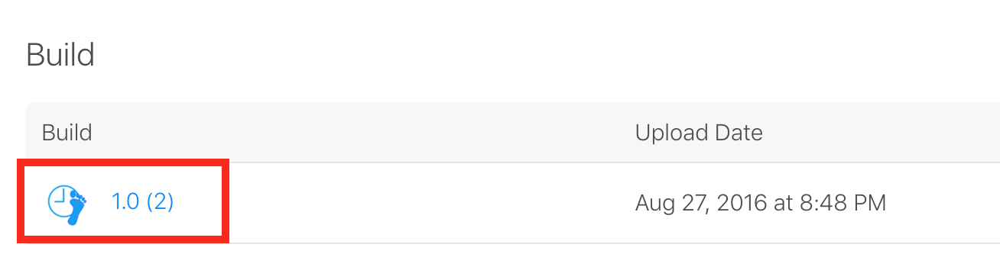
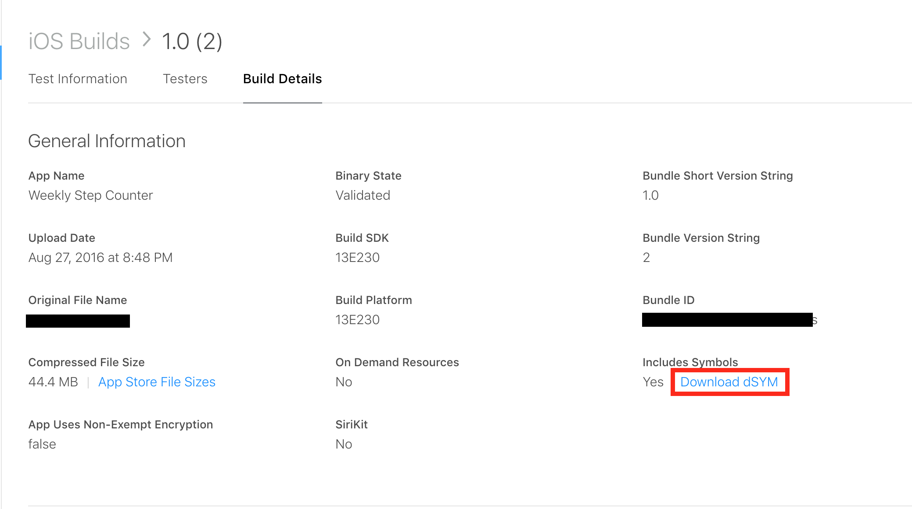

# Flurry Upload Clients

Flurry's Crash service can symbolicate the crashes reported by Flurry's SDK.
This script uploads the symbols required to properly symbolicate crashes from
iOS applications.

## How to send iOS symbols at build time

1. Ensure that your project is configured to build dSYM bundles
  
1. Copy the python script at `xcode/upload-symbols.py` to the root of your project directory
1. In XCode add a `Run Script` build phase
  
1. Add a configuration file in the root of your project `flurry.config`. Contents:
  ```
  [flurry]
  token=TOKEN
  api-key=API_KEY
  ```
1. Configure the build phase. You can find your API key in the Flurry Developer portal or in you `AppDelegate`
  ```
  ./upload-symbols.py -c flurry.config
  ```
  

Now whenever you build your application you will upload symbols to Flurry's symbolication service. If you wish
you can configure your symbols to be sent only when you build an archive of your project; this is achieved by checking
the _Run script only when installing` checkbox in the configuration.

## How to send iOS symbols for a BitCode enabled app

1. Download symbols from iTunesConnect
  - Go to iTunesConnect
  
  - Go to _My Apps_
  - Select the app you want symbols for
  - Inspect the current version
  
  - Open the build
  
  - Download the dsyms
  
1. Run the script using the `-p <path to downloaded file>` argument. eg.
```
./upload-symbols.py -c flurry.config -p ~/Downloads/dSYMs.zip
```
